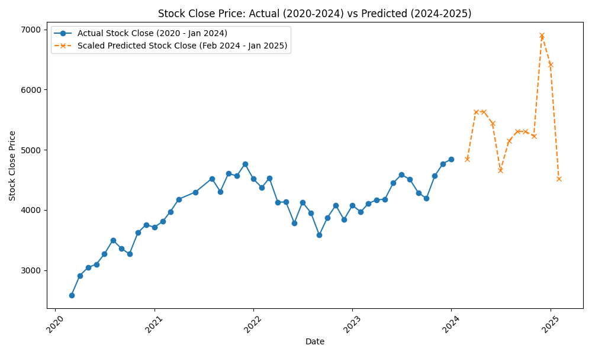

# Project 04 - Predictions Utilizing Various ML Models

**Jorge Benavente**,  
**Elizabeth Dutton**,  
**Victoria Scott**,  
**Nestor Gomez**

## Objective
This project focuses on using historical data on layoffs, mortgage rates, unemployment rates, stock market performance, and wage information to develop machine learning (ML) models for predicting stock market values.

## Slide Presentation
A comprehensive slide deck summarizing the **random forest model** and the **gradient boosting model** predictions is available [here](https://docs.google.com/presentation/d/1At24Lp1zJ_oxY6aGrxhRjLDrNptB0pVD3oqKOQS3ris/edit#slide=id.g2ffbaa39248_1_0). The slide includes visual representations of predictions, models used, and analysis of the stock close prices for the years 2020–2025.

## Data Used
### Economic Indicators
- **Mortgage Rates**: Trends in 30-year fixed mortgage rates provide insight into the housing market.
- **Federal Interest Rates (fed_rate)**: These rates impact business borrowing costs and economic activity.
- **Unemployment Rates**: Tracks the percentage of the labor force that is unemployed.

### Stock Market Data
- **Stock Prices**: Historical data from the S&P 500, including open, high, low, and close prices.
- **Adjusted Close and Volume**: Metrics to assess stock market volatility over time.

### Layoff and Business Metrics
- **Layoffs by Month**: Data on layoffs for the years 2020-2024.
- **Funds Raised by Month**: Tracks business growth and investments.
- **CPI and Wage Data**: Consumer price index and wage data provide additional context on inflation.

## Preprocessing
### Data Cleaning and EDA
We conducted thorough data cleaning and exploratory data analysis (EDA), including normalization, feature selection, and handling missing data, before building the model. The workflow was divided into various stages:

- **[CPI Transformation](patterns_predictions/CPI_transform.ipynb)**: Cleaning and transforming consumer price index data.
- **[Wage Data Processing](patterns_predictions/wages_tech.ipynb)**: Processing and cleaning wage data.
- **[Stock Data Transformation](patterns_predictions/stock_cleaning.ipynb)**: Cleaning and normalizing stock data.
 
### Banking, Credit and Asset panel data
The Money Stock Measures cover liquid forms of money, such as currency, demand deposits, and small-time deposits. The Assets and Liabilities of Commercial Banks report aggregated balance sheets for commercial banks. The Consumer Credit report details revolving and nonrevolving credit extended to consumers, showing growth rates, levels, and flows. After cleaning the data, we merged datasets and added new variables, then split and trained the data on a smaller scale. This analysis included both Consumer Credit and the monetary base.

### SQL Database
We used a PostgreSQL database to manage the large dataset. Queries were designed to maintain order and consistency, with special attention to ensure rows with missing data were preserved where possible.

## Exploring Patterns in Data
In the process of developing the model, I explored patterns in the data using **Principal Component Analysis (PCA)** and correlation heatmaps to identify relationships between key variables.

### PCA and Correlation Analysis
- **PCA (Principal Component Analysis)**: I performed dimensionality reduction using PCA, which allowed me to group important features and identify clusters in the data. You can find these visualizations in the [explore_patterns.ipynb](patterns_predictions/explore_patterns.ipynb) notebook, along with corresponding images like the **[explained variance plot](patterns_predictions/exploratory_data_pca/explained_variance_plot.png)** and **[elbow plot](patterns_predictions/exploratory_data_pca/elbow_plot.png)**, which helped determine the optimal number of components for PCA.

- **Correlation Heatmap**: I also generated a **[correlation heatmap](patterns_predictions/exploratory_data_pca/correlation_heatmap.png)** to visualize the relationships between different features. This provided valuable insights into how different variables are correlated, aiding in feature selection and model optimization.

## Machine Learning Model
### Gradient Boosting Regressor
After cleaning the data, we selected the **Gradient Boosting Regressor** due to its robustness in handling non-linearities and its ability to handle various types of data. The model was trained on historical stock data, including close prices, with features like unemployment rate, federal interest rates, and mortgage rates contributing to the prediction.

**[Jupyter Notebook for Stock Prediction](patterns_predictions/Predict_Stock_Prices.ipynb)**

- **Prediction**:
  - **MSE**: 21,488.60
  - **R²**: 0.92
  
  The model produced accurate results for stock prices, predicting upward and downward trends with significant accuracy.

**Prediction Visualization**:  

## Limitations
1. **Timeframe**: Our dataset spans only four years, which limits the predictive power.
2. **Data Quality**: Some data points, particularly in layoffs and wages, were missing, which could affect the accuracy of the model.
3. **Sector Focus**: Data was mainly focused on the tech sector, potentially limiting broader application.

## Next Steps
1. **Expand the timeframe**: Including more historical data could improve predictions.
2. **Lag Effect Analysis**: Examining potential lag between economic indicators and stock prices.
3. **Broaden the dataset**: Incorporating more sectors and global economic indicators.

## Data Sources
- **[Layoffs Data](https://www.kaggle.com/datasets/theakhilb/layoffs-data-2022/data)**
- **[Federal Interest Rates](https://fred.stlouisfed.org/series/FEDFUNDS)**
- **[Mortgage Rates](https://fred.stlouisfed.org/series/MORTGAGE30US)**
- **[Unemployment Rate](https://fred.stlouisfed.org/series/UNRATE)**
- **[S&P 500 Historical Stock Data](https://finance.yahoo.com/quote/%5EGSPC/history/?guccounter=1)**
- **[Wage and CPI data](https://www.bls.gov/) - Bureau of Labor Statistics**
